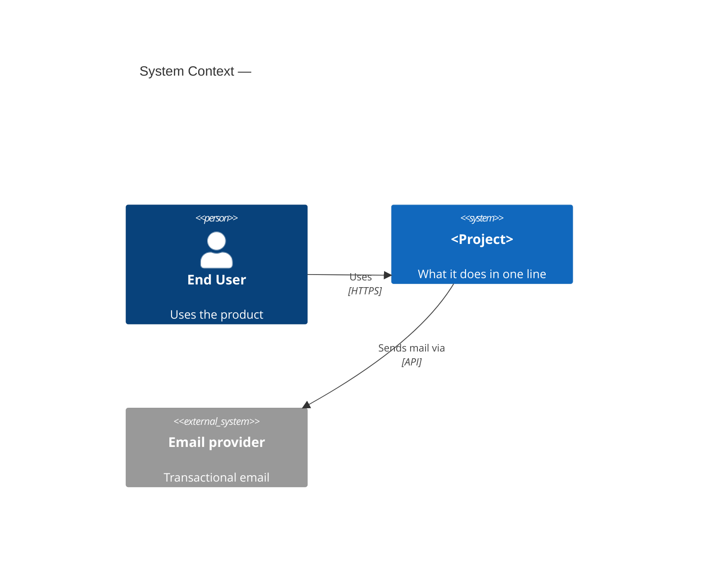
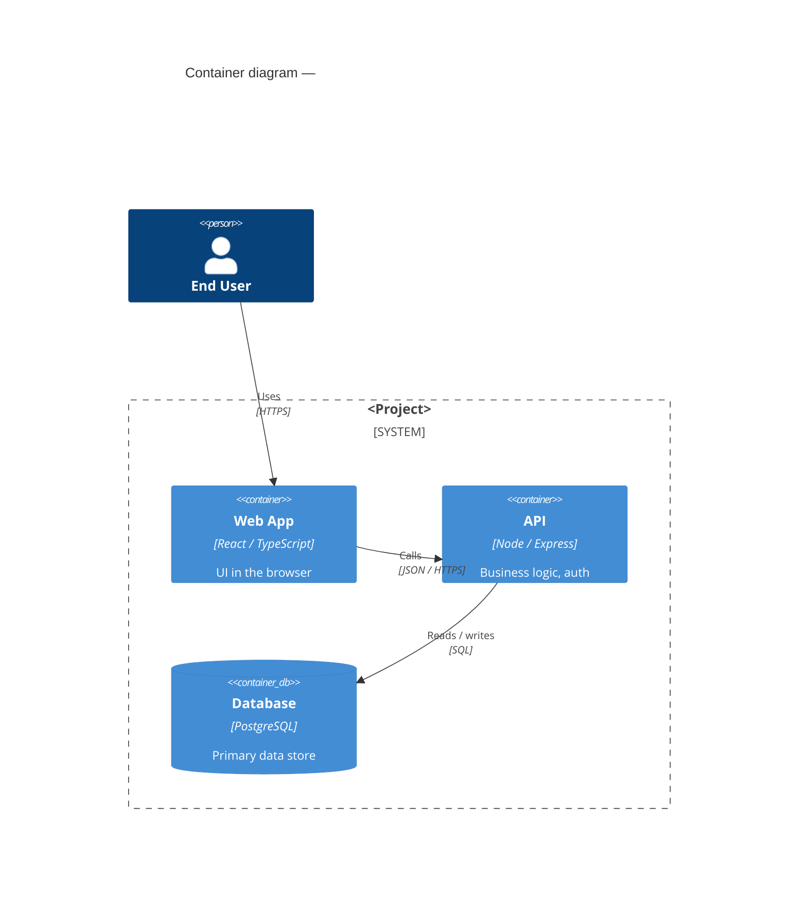

# TAI Setup — Repo Docs Bootstrap

Initialize a repository for TAI skills by creating the shared `docs/` structure,
minimal source-of-truth documents, and `.tai/` runtime directories that downstream
skills consume.

This skill handles initial bootstrap. It is idempotent —
safe to re-run to repair missing docs.

## Document-Driven Framework (read first)

This scaffold implements a layered, doc-first workflow. The layers, in order:

- **L0 — `docs/prd.md`** — product intent / PRD. **HUMAN-owned.** Agents must
  not author or rewrite it; they may quote it. Created/edited by humans (or via
  `/plan-product`, `/tai-plan-ceo` as a human-driven session).
- **L1 — `docs/decisions/` + `docs/architecture.md`** — Architecture Decision
  Records and the C4 system shape. **ADRs are human-accepted**; an agent may
  *draft* an ADR but a human flips `status: accepted`.
- **L2 — `docs/specs/`** — behavioral contracts. **Agents draft specs**, but a
  human gates `status: approved` before any code under a spec's `code:` path
  merges. This is the layer the conformance gate checks.
- **L3 — code + tests** — agents write these to satisfy approved specs.

Core invariant — **doc-first order:** change the spec *before* the code, in the
same PR. Code under a spec's `code:` path may not merge until that spec is
`status: approved`. `docs/specs/` is the L2 layer; never edit a spec to match
code already written (that inverts the order). `docs-update` is post-ship and
touches derived/living docs only — it never edits `docs/specs/`.

## Outputs

Creates or refreshes (Markdown only — no HTML, no `_assets/`):

```text
docs/
  prd.md              # PRD / product intent — HUMAN-owned   (prd-one-pager template)
  architecture.md        # C4 Context+Container + §4 dir map     (architecture template)
  matrix.md              # requirements traceability matrix (generated, disposable)
  REVIEW.md              # conformance + human attention log
  changelog.md
  contributing.md
  decisions/
    adr.template.md      # ADR template (frozen records)         (adr template)
  specs/
    spec.template.md     # L2 behavioral contract                (spec template)
  plan/
    tasks.md
    backlog.md
.tai/
  state/
  cache/
  logs/
CLAUDE.md                # repo root — AI agent rules            (CLAUDE template)
README.md                # repo root — entry point               (README template)
```

Do **not** invent a full visual design system here. If `docs/design/visual.md`
is missing, leave it missing and recommend `/design-consultation` when visual UI
work is relevant.

## Preamble

```bash
_BRANCH=$(git branch --show-current 2>/dev/null || echo "unknown")
_REPO_ROOT=$(git rev-parse --show-toplevel 2>/dev/null || pwd)
_DOCS_DIR="$_REPO_ROOT/docs"
_STATE_DIR="$_REPO_ROOT/.tai/state"
_CACHE_DIR="$_REPO_ROOT/.tai/cache"
_LOGS_DIR="$_REPO_ROOT/.tai/logs"
_DATE=$(date +%Y-%m-%d)
echo "BRANCH: $_BRANCH"
echo "REPO_ROOT: $_REPO_ROOT"
echo "DATE: $_DATE"
```

## Language

Respond in the same language the user is using. Keep generated `docs/` section
headers in English for machine consumption. Keep technical terms, paths, commands,
and JSON/log output in English.

## Safety Rules

- Preserve existing human-written docs. Never overwrite or delete non-empty files
  without first reading them and asking the user.
- `docs/prd.md` is **HUMAN-owned (PRD)**. Only ever create a stub if it is
  missing; never overwrite or rewrite an existing one.
- Reorganization/deletion is allowed only after an explicit AskUserQuestion choice.
  Prefer moving legacy docs into canonical `docs/` paths over deleting them.
- `.tai/` is runtime state/cache/logs and should be gitignored.
- `docs/` is committed project knowledge and should not be gitignored.
- Do not read secrets. Note existence only for `.env*`, private keys, credential
  files, token files, and ignored files that appear secret-bearing.
- Prefer creating small, honest stubs over pretending decisions have been made.
- This skill prepares the repo; it does not do product strategy, engineering plan
  review, design-system creation, implementation, QA, or shipping.

## Step 1: Detect Current State

Run:

```bash
find "$_DOCS_DIR" -maxdepth 3 -type f 2>/dev/null | sort || true
test -f "$_DOCS_DIR/prd.md" && echo "HAS_INTENT=true" || echo "HAS_INTENT=false"
test -f "$_DOCS_DIR/design/visual.md" && echo "HAS_VISUAL=true" || echo "HAS_VISUAL=false"
test -f "$_DOCS_DIR/plan/tasks.md" && echo "HAS_TASKS=true" || echo "HAS_TASKS=false"
test -f "$_DOCS_DIR/plan/backlog.md" && echo "HAS_BACKLOG=true" || echo "HAS_BACKLOG=false"
```

If docs already exist, treat this as an **idempotent repair/refresh**:
- Create missing directories/files.
- Preserve existing content.

## Step 1A: Discover Legacy or Scattered Docs

Before creating new docs, look for existing planning/design/project documents that
other skills may need but that are outside the canonical structure.

Run:

```bash
find "$_REPO_ROOT" -maxdepth 3 \( \
  -path "$_REPO_ROOT/.git" -o \
  -path "$_REPO_ROOT/.tai" -o \
  -path "$_REPO_ROOT/node_modules" -o \
  -path "$_REPO_ROOT/.venv" -o \
  -path "$_REPO_ROOT/vendor" \
\) -prune -o -type f \( \
  -iname 'PLAN.md' -o -iname 'PLANNING.md' -o -iname 'ROADMAP.md' -o \
  -iname 'TODO.md' -o -iname 'TODOS.md' -o -iname 'BACKLOG.md' -o \
  -iname 'DESIGN.md' -o -iname 'ARCHITECTURE.md' -o -iname 'SYSTEM.md' -o \
  -iname 'SPEC.md' -o -iname 'SPECS.md' -o -iname 'REVIEW.md' -o \
  -iname 'CHANGELOG.md' -o -iname 'CONTRIBUTING.md' -o -iname 'README.md' -o \
  -iname 'INTENT.md' -o -iname 'PRD.md' -o -iname 'DECISIONS.md' \
\) -print | sort
```

Classify findings:

| Legacy/scattered file | Canonical destination |
|---|---|
| `PLAN.md`, `PLANNING.md` | `docs/plan/tasks.md` |
| `ROADMAP.md` | `docs/plan/backlog.md` (Active section) |
| `TODO.md`, `TODOS.md`, `BACKLOG.md` | `docs/plan/backlog.md` |
| `PRD.md`, `INTENT.md` | `docs/prd.md` (HUMAN-owned — migrate, do not rewrite) |
| `DESIGN.md` | `docs/design/visual.md` if visual/brand-focused; `docs/architecture.md` if architecture-focused |
| `ARCHITECTURE.md`, `SYSTEM.md` | `docs/architecture.md` |
| `SPEC.md`, `SPECS.md` | `docs/specs/{slug}.md` |
| `DECISIONS.md` | split into `docs/decisions/NNNN-{slug}.md` |
| root `REVIEW.md` | `docs/REVIEW.md` |
| root `CHANGELOG.md` | `docs/changelog.md` |
| root `CONTRIBUTING.md` | `docs/contributing.md` |
| `README.md` | keep in place; optionally link/summarize from `docs/prd.md` |

If any legacy/scattered docs exist, read only enough to classify them and ask one
batched AskUserQuestion before reorganizing:

```text
I found existing project docs outside the canonical TAI docs structure.

Recommended migration:
1. PLAN.md → docs/plan/tasks.md (merge, then delete old file)
2. ARCHITECTURE.md → docs/architecture.md (merge, then delete old file)
3. SPEC.md → docs/specs/{slug}.md (merge, then delete old file)
...

RECOMMENDATION: Choose A because keeping one canonical docs tree prevents skills
from reading stale files.

A) Reorganize — merge/move into canonical docs paths and delete old files after successful migration
B) Copy only — copy/merge into canonical docs paths but keep old files with a "migrated" note
C) Leave as-is — create missing canonical docs but do not touch old files
```

Rules:
- If **A**, migrate content, verify destination exists and contains the old content,
  then delete the old file. Never delete `README.md`.
- If **B**, migrate/copy content but keep old files. Add a short note at the top of
  old docs: `Moved to docs/... on YYYY-MM-DD; kept for compatibility.`
- If **C**, leave old files untouched and mention stale-doc risk in final concerns.
- If a destination already has substantial content, merge under a section named
  `## Migrated from {old path} ({date})` instead of overwriting.
- Track every migrated/copied/deleted file for the final report.

## Step 2: Initialize Directories and Gitignore

```bash
mkdir -p "$_DOCS_DIR/decisions" "$_DOCS_DIR/specs" "$_DOCS_DIR/plan"
mkdir -p "$_STATE_DIR" "$_CACHE_DIR" "$_LOGS_DIR"
if [ -f "$_REPO_ROOT/.gitignore" ]; then
  grep -q '^\.tai/' "$_REPO_ROOT/.gitignore" 2>/dev/null || echo '.tai/' >> "$_REPO_ROOT/.gitignore"
else
  echo '.tai/' > "$_REPO_ROOT/.gitignore"
fi
```

## Step 3: Create or Merge Core Docs

Only create a file if it does not exist. If it exists, leave it untouched unless
it is empty or the user approved migration from a legacy doc.
When merging approved legacy docs, append migrated content under a clearly labeled
section rather than replacing existing canonical content.

### `docs/prd.md` (HUMAN-owned PRD)

This is the L0 product intent, owned by humans. Create this stub **only if it is
missing**. Never rewrite an existing `prd.md`. Recommend `/plan-product` or
`/tai-plan-ceo` for a human-driven discovery session.

```markdown
---
id: prd
type: prd
parent: null
children: []
related: []
status: draft      # draft | approved | shipped
---

# <Product / repo name> — One-Pager

> **Keeping this alive:** Write it *before* building, not after. Once shipped, set status to `shipped` and leave it as a record — don't try to keep it matching the evolving product (that's the code's job). One page max; if it's longer, you're over-specifying.
>
> **Owner: HUMAN.** This is the product intent (L0). Agents may quote it but must not author or rewrite it. Run `/plan-product` for discovery or `/tai-plan-ceo` for strategic scope review.

## Problem
What user problem are we solving? Why now?

## Who it's for
Primary user / segment.

## Goal & success metric
What "good" looks like, measurably. (e.g., "X% of users complete Y")

## Scope
**In:** what we will build.
**Out:** what we explicitly won't (this trip).

## How it works (rough)
2–4 sentences or a short flow. Not a spec.

## Open questions / risks
- ...
```

Replace `YYYY-MM-DD` with the actual date (`$_DATE`).

### `docs/architecture.md`

The C4 system shape (L1). Run `/tai-plan-eng` to replace the placeholders with a
reviewed architecture. The §4 container→directory map is what the conformance
gate checks `code:` paths against.

```markdown
---
id: architecture
type: architecture
parent: null
children: []
related: []
derived: true
---

> ⚠️ Derived doc — maintained live by an agent as code changes; may still lag. Source of truth is `docs/specs/` + `docs/prd.md`. Regenerate, don't hand-edit as canon.

# Architecture — <Project>

> **Keeping this alive:** Only document what changes slowly — system shape and relationships, not function-level detail (read that from code). Update §1–2 only when a container or relationship is added/removed — that should be rare. Edit the diagram in the *same PR* as the structural change. Link to directories, not files. If you're tempted to describe code line-by-line, stop and let the code speak.

> C4 model. We document **Context** and **Container** always, and add a
> **Component** view only for complex containers. We do NOT draw the Code level —
> that's read from the source. Diagrams are Mermaid so they live in the repo and
> diff in PRs.

## 1. Context — the system and its world
Who uses the system and what external systems it talks to. One box for us.



## 2. Container — the runnable pieces
The deployable units (apps, APIs, datastores, workers) and how they communicate.



## 3. Component — inside a container (optional)
Only for a container complex enough to warrant it.

## 4. Container → code mapping
Where each element above lives in the repo. Link to **directories** (they rot less
than files). This table also doubles as the "where the code lives" map in CLAUDE.md
and is the source the conformance gate uses to validate every spec's `code:` path.

| Element (from diagrams) | Code | Notes |
|-------------------------|------|-------|
| Web App | [`web/`](../web) | |
| API | [`api/src/`](../api/src) | |
| Database schema | [`api/migrations/`](../api/migrations) | source of truth for schema |

## 5. Key decisions
Link to the ADRs; don't restate the *why* here.
- [ADR-0001](decisions/) — <title>

## Maintenance
- Update §1–2 when a container is added/removed or a relationship changes (rare).
- Update §4 when a top-level directory moves.
- Everything finer-grained is read from code, not maintained here.
```

Replace `YYYY-MM-DD` with the actual date (`$_DATE`).

### `docs/plan/tasks.md`

```markdown
---
id: plan-tasks
type: plan
parent: null
children: []
related: []
---

# Execution Tasks

## Phases
- TODO: Run `/tai-plan-eng` to generate implementation-ready tasks.
```

Replace `YYYY-MM-DD` with the actual date (`$_DATE`).

### `docs/plan/backlog.md`

The home for deferred and declined work. Two sections: **Active** (scheduled
deferred work — will do, just not this PR) and **Backlog** (someday / declined
ideas + tech debt). The capture reflex appends here.

```markdown
---
id: plan-backlog
type: plan
parent: null
children: []
related: []
---

# Backlog

## Active
Scheduled deferred work — will do, just not this PR.
- [ ] {task} — from {feature/spec}, deferred YYYY-MM-DD

## Backlog (someday / declined)
Unscheduled — someday / maybe / declined ideas + tech debt.
- {idea} — noted YYYY-MM-DD, from {feature}, why deferred: {reason}
```

Replace `YYYY-MM-DD` with the actual date (`$_DATE`).

### `docs/REVIEW.md`

```markdown
---
id: review
type: review
parent: null
children: []
related: []
---

# Human Attention Log

Items below need human review. Agents append when making decisions not covered by
existing specs or when deviating from plan. This is also where the conformance gate
records spec-approval and trace findings.

## Open Items

## Resolved Items
```

Replace `YYYY-MM-DD` with the actual date (`$_DATE`).

### `docs/changelog.md`

```markdown
---
id: changelog
type: changelog
parent: null
children: []
related: []
derived: true
---

> ⚠️ Derived doc — maintained live by an agent as code changes; may still lag. Source of truth is `docs/specs/` + `docs/prd.md`. Regenerate, don't hand-edit as canon.

# Changelog

## Unreleased
- Initialized TAI docs scaffold.
```

Replace `YYYY-MM-DD` with the actual date (`$_DATE`).

### `docs/contributing.md`

```markdown
---
id: contributing
type: contributing
parent: null
children: []
related: []
derived: true
---

> ⚠️ Derived doc — maintained live by an agent as code changes; may still lag. Source of truth is `docs/specs/` + `docs/prd.md`. Regenerate, don't hand-edit as canon.

# Contributing

## Local Development
TODO: Run `/docs-init` to refresh conventions, then document setup commands here.

## Tests
TODO: Document test commands after detection or bootstrap.

## Doc-first rule
Change the governing spec under `docs/specs/` *before* the code, in the same PR.
Code under a spec's `code:` path does not merge until that spec is `status: approved`.
```

Replace `YYYY-MM-DD` with the actual date (`$_DATE`).

### `docs/specs/spec.template.md`

This is the L2 behavioral-contract template. Do not fill it in — skills like
`/plan-eng` draft concrete specs from it. **One spec = one public surface.** Each
Behavior row has a stable `R-id` and is linked to a test; `code:`/`tests:`
frontmatter links the spec to implementation. A human gates `status: approved`
before code under `code:` merges. Precedence when sections disagree:
**Invariants > Interface > Behavior.**

```markdown
---
# Required frontmatter — CI/AI checks these fields exist
id: SPEC-<area>-<name>      # e.g. SPEC-auth-login
type: spec
status: draft              # draft → approved (human gate) → implemented
approved_at:               # ISO timestamp, set when a human flips to approved
implements: [prd]          # intent ids this realizes, e.g. [prd, 0003-some-adr]
parent: architecture
children: []
related: []
code: <dir or file>        # where the implementation lives, e.g. api/src/auth/
tests: <dir or file>       # where the spec-derived tests live
---

# <Component / Feature> — Spec

> **Keeping this alive:** This is the *ground truth* the code is verified against — it is **living**, not frozen. Change this spec *before* the code, in the same PR; CI rejects code changes under `code:` with no matching change here. Keep it behavioral (what, observable), never implementation detail (how) — that's the code's job and would just re-rot here. Every "Behavior" row should map to a test; if it can't be tested, it's too vague.

> **One spec = one public surface.** Write a spec per externally-observable entry point — an HTTP endpoint, event/message handler, queue consumer, scheduled job, or a module's exported API. **Never one per internal function.** Test: *can another team or agent depend on this without reading the code?* Yes → it needs a spec.

> **Precedence when sections disagree:** Invariants > Interface > Behavior. Invariants always hold; Interface is the contract shape; Behavior rows are the cases.

## Purpose
One or two sentences: what this unit does and why it exists. Link up to the
intent it serves (`implements:`), don't restate it.

## Interface
The contract surface. Signatures / endpoints / events — typed. This is what
callers depend on; changing it is a breaking change.

```
# e.g. function, HTTP endpoint, or message
login(email: string, password: string) -> Session | AuthError

POST /api/login
  body:  { email: string, password: string }
  200 -> { token: string, expiresAt: ISO8601 }
  401 -> { error: "invalid_credentials" }
```

## Behavior
Each row is one observable rule with a **stable ID** (`R1`, `R2`, … — never renumber;
add new ones, retire old ones). Use Given / When / Then with **concrete values**. Each
row's ID must appear in the test that covers it (name `test_R3_...` or a
`// covers: SPEC-auth-login R3` tag) — that link is how CI proves "code works as
described."

| ID | Given | When | Then |
|----|-------|------|------|
| R1 | a registered user | correct email + password | returns a token, `expiresAt` = now + 24h |
| R2 | a registered user | wrong password | returns `invalid_credentials` (401), no token |
| R3 | 5 failed attempts in 10 min | any 6th attempt | returns `rate_limited` (429), locks 15 min |

## Invariants
Things that must always hold, regardless of input. Property-level.
- A token is never issued without a matching credential check.
- Password is never logged, returned, or stored in plaintext.

## Data
Inputs, outputs, and state touched. Validation rules at the boundary.
- **In:** `email` (RFC5322), `password` (8–200 chars).
- **Out:** `Session { token, expiresAt }`.
- **Reads/writes:** `users`, `sessions`. (Schema source of truth: migrations.)

## Acceptance
The spec is `implemented` when every Behavior row and Invariant has a passing
test under `tests:`, and the trace check resolves.
- [ ] Each Behavior row ID (R1…RN) is referenced by a passing test.
- [ ] Each Invariant has a property/assertion test.
- [ ] `code:` and `tests:` paths exist; `code:` sits under a container in `docs/architecture.md` §4.

## Open questions
- ...
```

### `docs/decisions/adr.template.md`

This is the template for Architecture Decision Records (L1). Skills like
`/plan-eng` and `/tai-research` may *draft* concrete ADRs from it, but a human
flips `status: accepted`. ADRs are immutable point-in-time records.

```markdown
---
# Required frontmatter — CI/AI checks these fields exist
id: NNNN-<slug>    # e.g. 0001-token-storage
type: decision
status: proposed   # proposed | accepted | superseded | deprecated
parent: architecture
children: []
related: []
supersedes: none   # decision id (NNNN-slug) or none
---

# ADR-NNNN: <short decision title>

> **Keeping this alive:** ADRs are immutable point-in-time records — they never go stale because they describe a *past* decision. Don't edit an accepted ADR; if the decision changes, write a new one and set the old one's status to `superseded`. Write it when the decision is made, while the context is fresh. Short is fine.
>
> **Ownership:** an agent may draft an ADR; a human accepts it (flips `status: accepted`).

## Context
What's the situation? What forces are at play (constraints, requirements, trade-offs)?
Keep to a few sentences.

## Decision
What we decided to do. State it plainly: "We will ..."

## Consequences
What becomes easier, what becomes harder, what we're accepting as the cost.

## Alternatives considered
- Option A — why not.
- Option B — why not.
```

### `docs/matrix.md`

The traceability matrix — the "are we done?" dashboard. Links specs, Behavior row
IDs, implementation files, and test files. **Generated and disposable — never
hand-authored.** Regenerate it; don't trust it as source.

```markdown
---
id: matrix
type: matrix
parent: null
children: []
related: []
derived: true
---

> ⚠️ Derived doc — maintained live by an agent as code changes; may still lag. Source of truth is `docs/specs/` + `docs/prd.md`. Regenerate, don't hand-edit as canon.

# Requirements Traceability Matrix

| SPEC ID | Behavior row | Code (`code:`) | Tests (`tests:`) | Status |
|---------|--------------|----------------|------------------|--------|
| _No specs created yet. Run `/plan-eng` to draft specs._ | | | | |

## Coverage Summary
- Total specs: 0
- Approved: 0
- Implemented: 0
- Draft: 0

## Untraced Code
Files with significant logic not governed by any spec — populated by `/docs-update`.
```

Replace `YYYY-MM-DD` with the actual date (`$_DATE`).

### `CLAUDE.md` (repo root)

The AI agent rules, read on every task. Create only if missing; never overwrite an
existing one without user approval.

```markdown
# Project rules for AI coding agents

> **Keeping this alive:** Read by AI on every task, so wrong content here causes wrong code *everywhere* — treat it like config. Keep it short and at the conventions/architecture level; never mirror the codebase in prose. Update it in the *same PR* as any convention or structure change. If a rule no longer holds, delete it — a stale rule is worse than none.

## What this project is
One paragraph: purpose, stack, where the important code lives.

## Conventions
The code-style and patterns rules a contributor needs before writing code here.
- Language / style: <e.g. TypeScript strict, Prettier, no default exports>
- Naming / error handling: <key patterns used repeatedly>
- Common patterns: <the 3-5 patterns used everywhere, e.g. "all API routes use X middleware">
- Branching: `main` is deployable. Feature branches `feat/...`, fixes `fix/...`.
- Commits: <e.g. Conventional Commits>
- Gotchas: <anything that would surprise a new contributor>

## Testing
- Run tests with: `<test command>`
- Framework: <e.g. pytest, vitest>; tests live in `<dir>`.
- Philosophy: <unit-heavy? integration-heavy? e2e?>
- Tests required for: <e.g. all new business logic>
- Each test references the spec Behavior row ID it covers (`test_R3_...` or `// covers: <SPEC-id> R3`).

## Always
- Run `<test command>` before declaring a task done.
- Update `docs/` when behavior or architecture changes.

## Note capture reflex
- When the user declines or defers a suggestion, append one line to `docs/plan/backlog.md`
  before continuing — don't lose it, don't act on it.

## Never
- Don't commit secrets or edit `.env`.
- Don't add a dependency without noting why in an ADR.
- Don't change a public surface without updating its spec first.

## Doc-first rule (the core invariant)
Docs are ground truth; code is derived. **Change the spec before the code, in the same PR.**
- Before editing code under a unit, open its `docs/specs/<area>-<name>.md` and change it first.
- Code under a spec's `code:` path does not merge until that spec is `status: approved`.
- The spec's Behavior rows are the test contract. Make the code pass them; don't rewrite the
  spec to match code you already wrote — that inverts the order.
- Each test references the Behavior row ID it covers (`test_R3_...` or `// covers: <SPEC-id> R3`).

## Layers & ownership
- `docs/prd.md` (L0) — product intent / PRD. **HUMAN-owned.**
- `docs/decisions/` + `docs/architecture.md` (L1) — ADRs (human-accepted; agent may draft) + C4 shape.
- `docs/specs/` (L2) — behavioral contracts. Agents draft; a human gates `status: approved`.
- code + tests (L3) — agents write these to satisfy approved specs.

## Doc format rules (enforced)
- New decision → `docs/decisions/NNNN-title.md` from `docs/decisions/adr.template.md`.
- New behavioral unit → `docs/specs/<area>-<name>.md` from `docs/specs/spec.template.md`.
  Required sections: Interface, Behavior, Invariants, Acceptance. Set `code:` and `tests:`.

## How to run / test / deploy
```bash
<setup>
<test>
<deploy>
```
```

### `README.md` (repo root)

Entry point for new devs. Create only if missing; never overwrite an existing one
without user approval.

```markdown
# <Project Name>

> **Keeping this alive:** The most-read file — optimize for a new dev getting running in <5 min. Update it in the *same PR* that changes any setup/run/test command. If a step here is wrong, the project feels broken. Keep prose minimal; link out for depth.

> One sentence: what this project does and for whom.

## Stack
- Language / framework:
- Database / services:
- Key dependencies:

## Setup
```bash
git clone <repo>
cd <repo>
<install command>
cp .env.example .env   # fill in values
```

## Run
```bash
<run command>          # local dev
```

## Test
```bash
<test command>
```

## Project structure
- `src/` — ...
- `tests/` — ...
- `docs/` — architecture, ADRs, specs, templates

## Useful links
- Product intent: `docs/prd.md`
- Architecture overview: `docs/architecture.md`
- Decisions: `docs/decisions/`
- Specs: `docs/specs/`
```

## Step 4: Detect Stack, Conventions, and Tests

The codebase shape is **not** maintained as standalone trace docs. Instead, fold
what you can infer into the derived docs that already have a home:

- **Stack** (language, framework, database, services) → README.md "Stack" section.
- **Conventions** (style, naming, error handling, common patterns, gotchas) → CLAUDE.md "Conventions".
- **Testing** (command, framework, philosophy, where tests live) → CLAUDE.md "Testing" and README.md "Test".
- **Code map** (container → directory) → `docs/architecture.md` §4.

Detect these by scanning config files (package manifests, lockfiles, CI config, test
config) and a light read of entry points. Replace the matching placeholders in the
scaffolded README.md / CLAUDE.md / architecture.md — do not create new files for them.
Never read or quote secret-bearing files; note existence only. Avoid unbounded scans
of dependency/vendor/build dirs.

Per-concept walkthroughs ("how does auth work") are **generated on demand** (e.g. a
tutorial run), never kept as files here.

## Step 5: Validate Docs

Verify the scaffold is complete and internally consistent:

```bash
for f in prd.md architecture.md matrix.md REVIEW.md changelog.md contributing.md \
         decisions/adr.template.md specs/spec.template.md \
         plan/tasks.md plan/backlog.md; do
  test -f "$_DOCS_DIR/$f" && echo "OK   $f" || echo "MISS $f"
done
test -f "$_REPO_ROOT/CLAUDE.md" && echo "OK   CLAUDE.md" || echo "MISS CLAUDE.md"
test -f "$_REPO_ROOT/README.md" && echo "OK   README.md" || echo "MISS README.md"
```

Then sanity-check that no broken relative links remain and that every created spec
sets `code:`/`tests:`. If validation finds issues in files this skill created, fix
them. If existing human docs have issues, report them as concerns and do not
rewrite large files without user approval.

## Step 6: Summarize and Recommend Next Skills

Run:

```bash
find "$_DOCS_DIR" -maxdepth 3 -type f | sort
mkdir -p "$_LOGS_DIR"
echo "{\"skill\":\"setup\",\"timestamp\":\"$(date -u +%Y-%m-%dT%H:%M:%SZ)\",\"status\":\"complete\"}" >> "$_LOGS_DIR/setup-log.jsonl"
```

Final response:

```text
STATUS: DONE | DONE_WITH_CONCERNS | BLOCKED

Docs initialized:
- [list created/kept files]

Docs reorganized:
- [list migrated/copied/deleted legacy files, or "none"]

Inferred context folded into derived docs:
- README.md "Stack" — [status]
- CLAUDE.md "Conventions" / "Testing" — [status]
- docs/architecture.md §4 code map — [status]

Validation:
- [validation result]

Recommended next:
- /plan-product — if product intent (docs/prd.md) is unclear (HUMAN-owned)
- /design-consultation — if UI/visual direction matters and docs/design/visual.md is missing
- /plan-ceo — for product/scope review
- /plan-eng — for implementation-ready plan/tasks and draft L2 specs
```

## Completion Status

- **DONE** — core docs exist, `.tai/` is gitignored, inferred context folded into
  README/CLAUDE/architecture, and validation has no errors in generated files.
- **DONE_WITH_CONCERNS** — setup completed but some existing docs need human cleanup,
  or some optional context could not be inferred.
- **BLOCKED** — repository is unreadable/unwritable or required user choice was not answered.

---
**Self-Improvement Rule:** If you run into a blocker, find a solution — then update this skill file so future runs don't hit the same issue.
