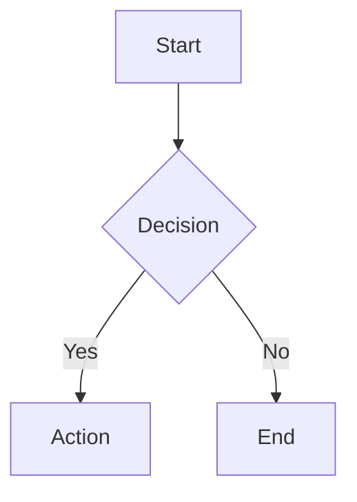

# /generate-pdf — Branded PDF Generation

Generate a professional, company-branded PDF document from Markdown content.

## How it works

1. Write content as a Markdown file
2. Compile to PDF using `tai pdf compile` with a company template
3. The template applies branding (logo, colors, headers, footers) automatically

## Prerequisites

- **Typst** must be installed: `brew install typst` (or `cargo install typst-cli`)
- **Templates** must be installed: `tai pdf setup-templates`

## Available templates

Check installed templates:
```bash
tai pdf setup-templates --list
```

Current templates:
- **proposal** — Client-facing proposal with executive summary, problem/solution, timeline, pricing
- **report** — Technical report with abstract, methodology, results, discussion, conclusion

## Usage

### Step 1: Write Markdown content

Create a `.md` file with the document content. Use standard Markdown:
- `# Heading 1` for main sections
- `## Heading 2` for subsections
- Regular paragraphs, lists, tables, code blocks all supported

### Step 2: Compile to PDF

```bash
# With a template (branded output):
tai pdf compile document.md --template proposal

# Without template (plain output):
tai pdf compile document.md

# Direct Typst file:
tai pdf compile document.typ

# Custom output path:
tai pdf compile document.md --template report --output final-report.pdf

# Debug mode (keeps intermediate .typ file):
tai pdf compile document.md --template proposal --debug
```

## Workflow for agents

When asked to create a document (proposal, report, etc.):

1. Create the markdown content file with appropriate sections
2. Run `tai pdf compile <file.md> --template <template-name>`
3. The PDF is generated in the same directory

## Template structure

Each template follows the Typst package format:
```
template-name/
  typst.toml          # Package manifest (name, version)
  lib.typ             # Styling function (layout, fonts, colors)
  template/
    main.typ           # Scaffold document for direct Typst editing
```

## Brand assets

Brand assets (logo, colors, company name) are installed alongside templates
at `~/.config/tai/brand/`. Templates automatically use these for consistent
branding across all document types.

## Diagrams and charts

### Mermaid — flowcharts only

Use Mermaid diagrams **only for flowcharts** (process flows, decision trees, sequence diagrams, state diagrams). Mermaid excels at structural/relational visuals but is not suited for data-heavy plots.

```markdown

```

### Python — data-heavy plots

For bar charts, line graphs, scatter plots, histograms, heatmaps, and any visualization driven by numerical data, generate the chart as a PNG using Python (matplotlib/seaborn) and embed it in the Markdown.

**Use the company color palette:**

```python
# Company color palette — use these for all data visualizations
COMPANY_COLORS = {
    "primary": "#2563EB",    # Blue — main data series, primary bars
    "secondary": "#7C3AED",  # Purple — secondary data series
    "accent": "#06B6D4",     # Cyan — highlights, callouts
    "success": "#10B981",    # Green — positive metrics
    "warning": "#F59E0B",    # Amber — caution, thresholds
    "danger": "#EF4444",     # Red — negative metrics, alerts
    "neutral": "#6B7280",    # Gray — baselines, gridlines
}

# Ordered list for cycling through multi-series charts
PALETTE = ["#2563EB", "#7C3AED", "#06B6D4", "#10B981", "#F59E0B", "#EF4444"]
```

**Workflow:**
1. Write a Python script that generates the chart as a `.png` file
2. Run the script with `python script.py`
3. Reference the image in Markdown: ``
4. Compile the document with `tai pdf compile`

## Troubleshooting

- **"Typst not found"** — Install Typst: `brew install typst`
- **"Template not found"** — Run `tai pdf setup-templates`
- **Compilation error** — Check the Typst stderr output in the error hint. Use `--debug` to inspect the intermediate `.typ` file.
- **First run slow** — Typst downloads the `cmarker` package on first use (requires internet).
