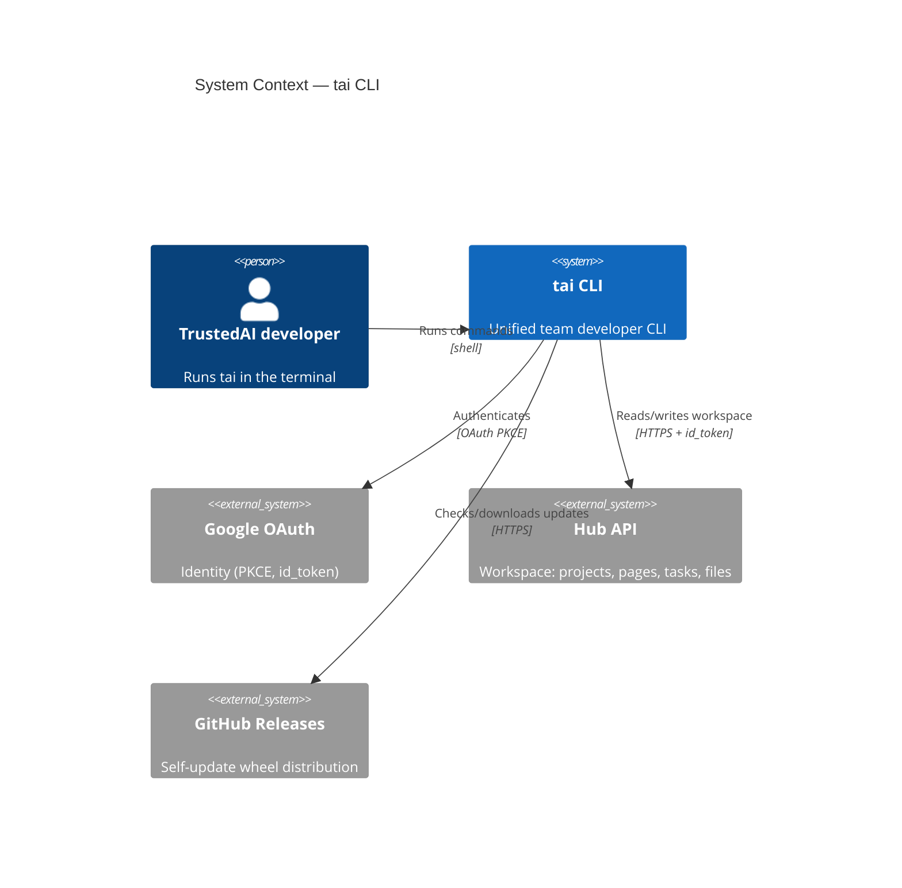
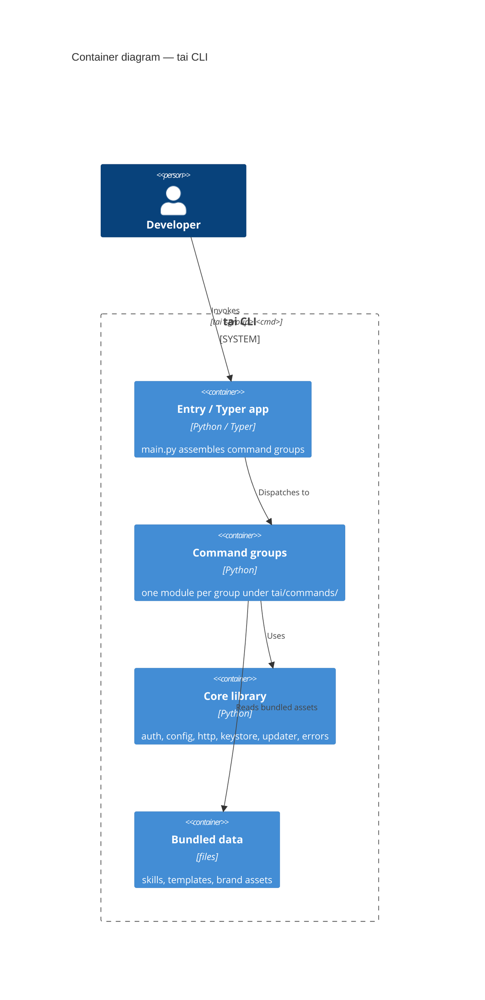

> ⚠️ Derived doc — maintained live by an agent as code changes; may still lag. Source of truth is `docs/specs/` + `docs/prd.md`. Regenerate, don't hand-edit as canon.

# Architecture — tai CLI

C4 Context + Container. Code level is read from source, not drawn here.

## 1. Context

## 2. Container

## 4. Container → code mapping

| Element | Code | Notes |
|---------|------|-------|
| Entry / Typer app | [`tai/main.py`](../tai/main.py) | entry point `tai.main:cli` |
| Command groups | [`tai/commands/`](../tai/commands) | one module per group |
| Core library | [`tai/core/`](../tai/core) | auth, config, http, keystore, updater, errors |
| Bundled data | [`tai/data/`](../tai/data) | skills, templates, brand assets |
| Hooks | [`tai/hooks/`](../tai/hooks) | Claude Code hooks |
| Plugins | [`tai/plugins/`](../tai/plugins) | entry-point plugin discovery |

## 5. Key decisions
- [0001-markdown-docs](decisions/0001-markdown-docs.md) — markdown document-driven framework (supersedes the legacy HTML docs).
